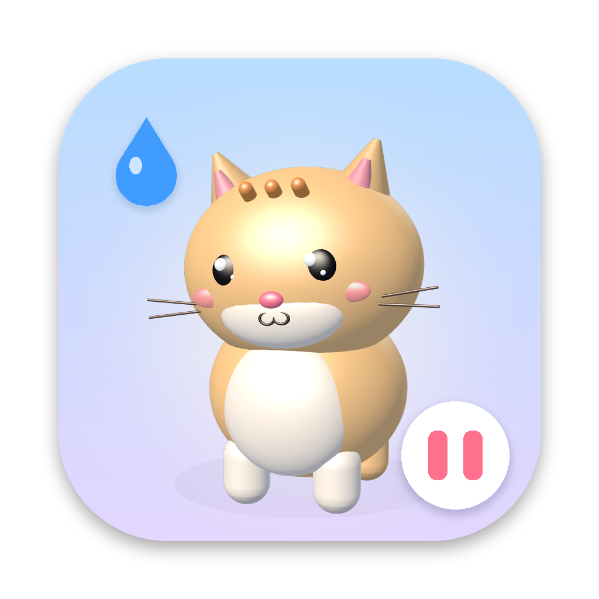
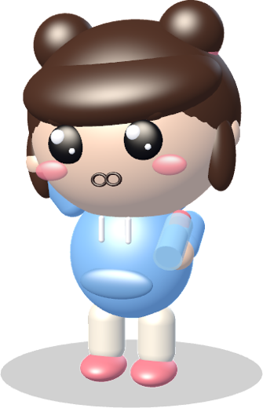
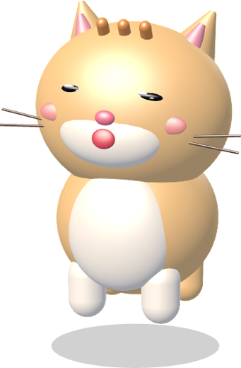
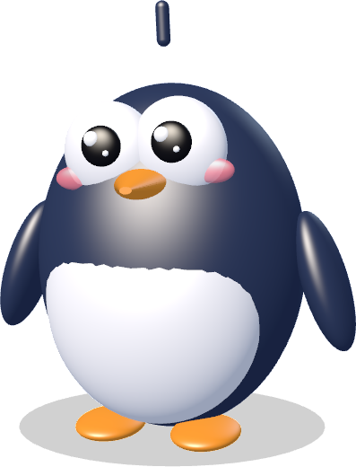
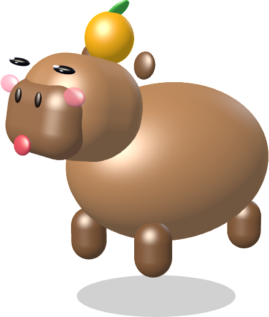
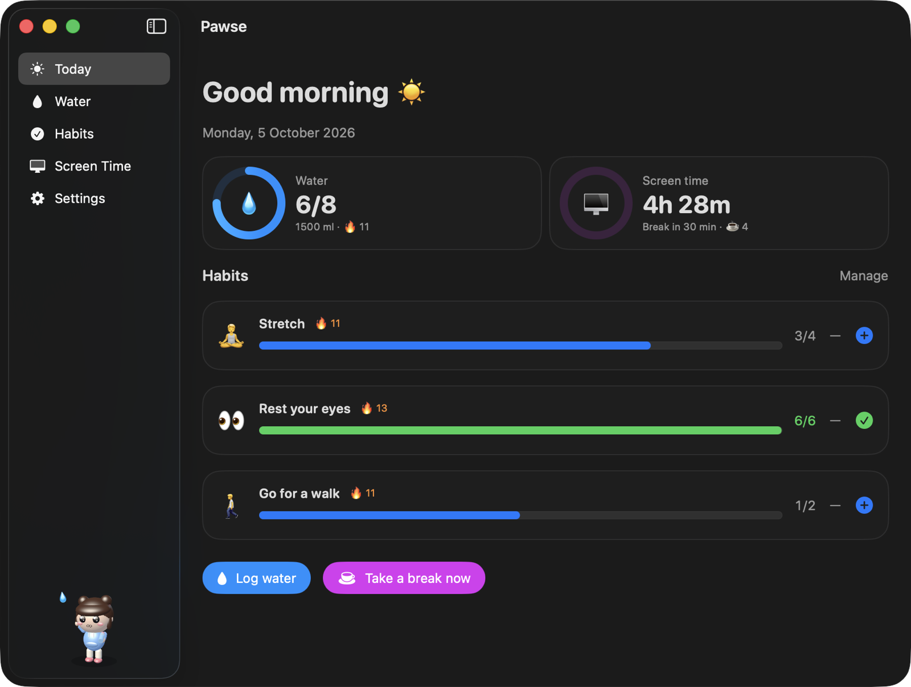
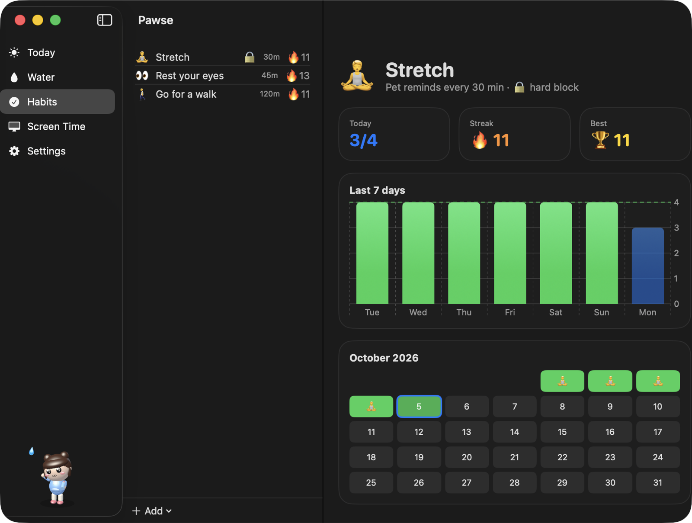
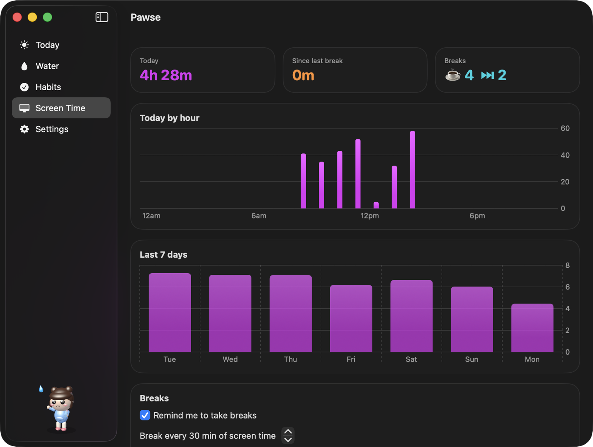
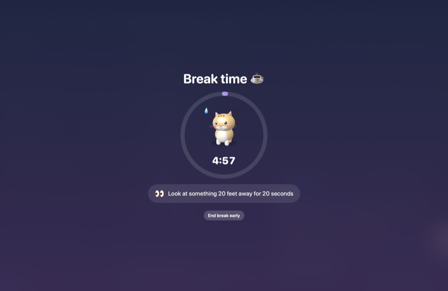
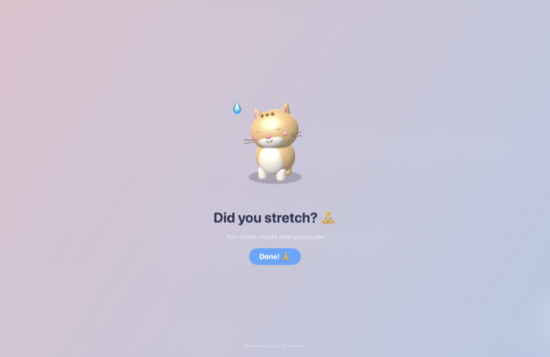

# Pawse

**A cute 3D pet that walks onto your Mac's screen and reminds you to drink water, keep your habits
and take breaks.**

**[Website](https://salahu01.github.io/pawse/)** ·
**[Download](https://github.com/salahu01/pawse-app/releases/latest)** ·
**[Project board](https://github.com/users/salahu01/projects/4)**

Most reminder apps send a notification you swipe away without reading. Pawse sends a pet instead. It
walks in from the edge of your screen, looks up at you and asks, *"Did you drink water?"*. Say yes and
it bounces with joy. Say "not yet" and it gets a little sad and comes back later, asking more sweetly
each time.

Menu bar only. No account, no internet, no tracking. Free and open source.

<p align="center">
  
  
  
  
  
</p>

## Features

**💧 Water.** Daily goal, glass size, streaks, a 7-day chart and a month calendar. The pet visits
on your schedule, within your active hours.

**✅ Habits, on any interval.** *Stretch every 30 minutes. Walk every 45. Rest your eyes every 20.*
Make any habit with any emoji, a daily goal and a reminder interval, and the pet asks *"Did you
stretch? 🧘"*. Each habit gets its own streak, chart and calendar.

**🖥️ Screen time and breaks.** Pawse measures how long you've been actively using the Mac (it pauses
when you step away) and, after 30 minutes of continuous use, asks you to take a break. Breaks are a
calm full-screen countdown with small tips: look 20 feet away, roll your shoulders, grab water.

**🔒 Hard block.** For the habits you're serious about, turn on hard block. The pet covers the whole
screen and it only unlocks when you say yes. It works for water, any habit, or breaks (no snoozing,
and you can't end early). Emergency exit: hold <kbd>Esc</kbd> for 5 seconds.

**🐾 Five pets with voices.** Momo the Chibi (with a voice and curious, happy and sad expressions),
Mochi the Cat, Pip the Penguin, Yuzu the Capybara and Boo the Ghost Bunny. They walk, blink, wave,
sip, bounce, droop and cry a little. Drop any `.usdz` 3D model in to add your own.

| Today | Habits | Screen time |
|---|---|---|
|  |  |  |

| Break | Hard block |
|---|---|
|  |  |

## Install

1. Download **Pawse-x.y.z.dmg** from the [latest release](https://github.com/salahu01/pawse-app/releases/latest).
2. Open it and drag **Pawse** into **Applications**.
3. Open Pawse. It appears in the menu bar, not the Dock.

> **First launch:** until the builds are notarised by Apple, macOS will say it can't verify the
> developer. Right-click **Pawse** in Applications → **Open** → **Open**. You only need to do this
> once. (Or run `xattr -dr com.apple.quarantine /Applications/Pawse.app`.)

Requires macOS 13 Ventura or later. Universal: Apple silicon and Intel.

## Privacy

Pawse makes **no network requests**. Your settings and history stay in
`~/Library/Preferences/com.swalahu.pawse.plist` and `~/Library/Application Support/Pawse/`. To
measure screen time it reads only *how many seconds ago* you last pressed a key or moved the mouse,
never what you typed or which apps you used.

## Build from source

```bash
git clone https://github.com/salahu01/pawse-app.git && cd pawse-app
./tools/bundle.sh          # -> build/Pawse.app (universal, ad-hoc signed)
./tools/make-dmg.sh        # -> build/Pawse-1.0.0.dmg
```

For a distributable build, sign with a Developer ID and notarise:

```bash
xcrun notarytool store-credentials pawse --apple-id you@example.com --team-id TEAMID --password <app-specific>
SIGN_IDENTITY="Developer ID Application: Your Name (TEAMID)" NOTARY_PROFILE=pawse ./tools/bundle.sh
SIGN_IDENTITY="Developer ID Application: Your Name (TEAMID)" NOTARY_PROFILE=pawse ./tools/make-dmg.sh
```

The GitHub release workflow does the same when the signing secrets are set (see
[`.github/workflows/release.yml`](.github/workflows/release.yml)).

## How it's made

- **SwiftUI + AppKit**, no third-party dependencies.
- **Pets are SceneKit models built from primitives** (spheres, capsules, cones) and animated
  procedurally every frame: walk cycles, blinking, squash and stretch, ear flops, tears. No model
  files needed.
- **Momo's voice** is Kokoro TTS (`af_bella`), pitched up, with expression sounds around each line.
  The animal sounds are real recordings from Wikimedia Commons.
- **Screen time** comes from `CGEventSource.secondsSinceLastEventType`: one number, sampled every 10 seconds.

See [CONTRIBUTING.md](CONTRIBUTING.md) for the layout and dev flags.

## Credits and licence

Code: MIT, see [LICENSE](LICENSE). Bundled sounds keep their own licences (CC0, public domain,
CC BY). See [CREDITS.md](CREDITS.md).
